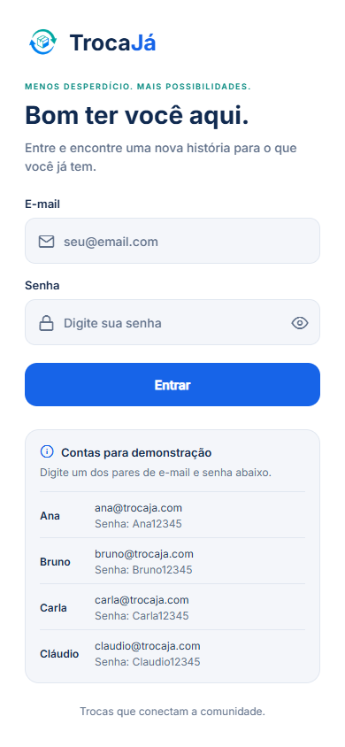
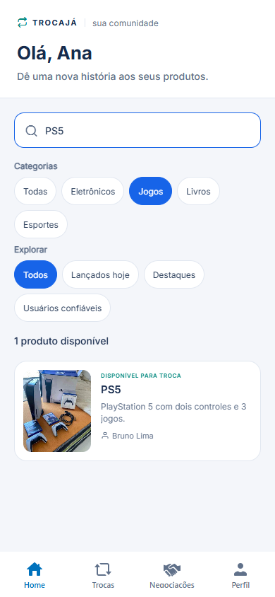
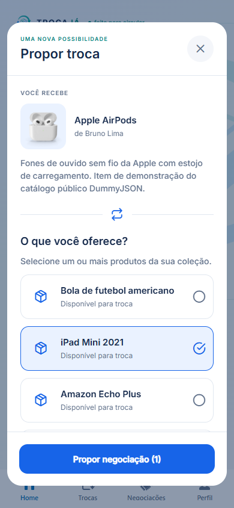
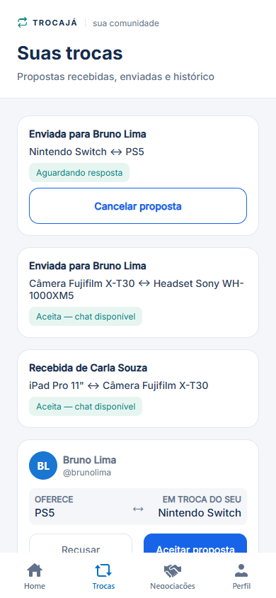
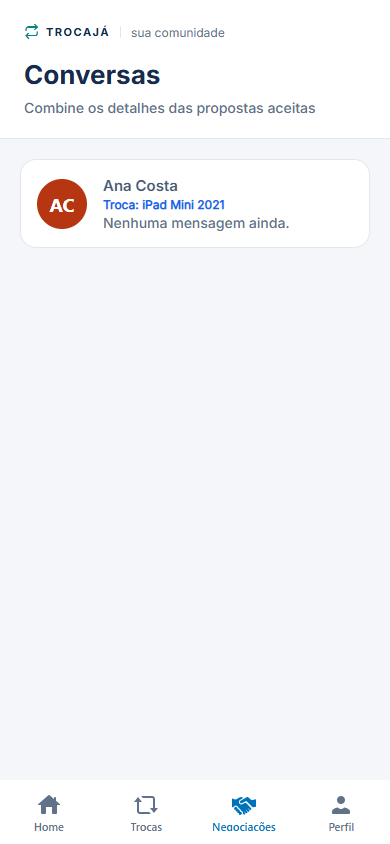
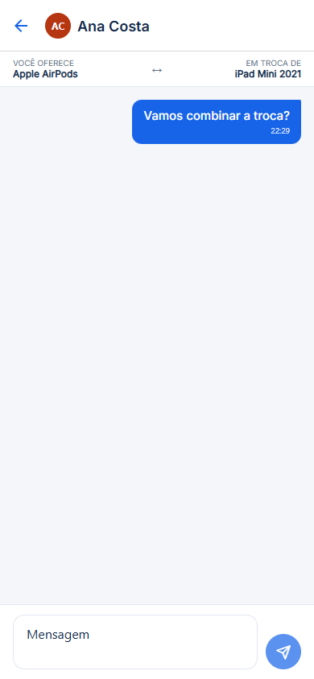
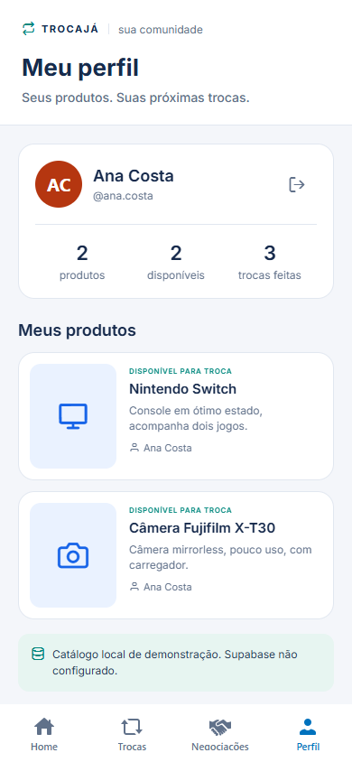

# TrocaJá — Checkpoint 5

Aplicativo de troca de produtos entre estudantes, desenvolvido em React Native, Expo e TypeScript. Facilita o reaproveitamento de itens e a negociação entre pessoas da comunidade acadêmica.

**Status:** protótipo funcional com mocks, testes automatizados e evidências reais no navegador. O adaptador Supabase está implementado, mas a conexão com um projeto real ainda precisa ser configurada e comprovada. Confira o [checklist de entrega](docs/ENTREGA-CP5.md).

## Integrantes e papéis

Distribuição proposta para esta entrega, a confirmar pelo grupo; não representa comprovação de autoria individual das alterações.

| Integrante | RM | Papel proposto |
| --- | --- | --- |
| Fernando Carlos Colque Huaranca | 558095 | Front-end e navegação |
| Gabriel Guilherme Leste | 558638 | Regras de negócio, mocks e integração Supabase |
| Gabriel Lacerda Araújo | 558307 | QA, testes e evidências de execução |
| Julia Carolina Ferreira Silva | 558896 | Design System, experiência e documentação |

## Requisitos do CP5

| Requisito | Implementação/evidência |
| --- | --- |
| Protótipo funcional | Contas fictícias, catálogo, filtros, propostas, histórico, aceite/recusa/cancelamento e chat |
| Dados mockados coerentes | 4 usuários, 4 categorias, 8 produtos; relações por ID; imagens locais ou ícones quando não há foto correspondente |
| Ambiente de testes | `npm run check`, Playwright e [roteiro manual](docs/TESTES.md) |
| Documentação | [Fluxos](docs/FLUXOS.md), [decisões técnicas](docs/DECISOES-TECNICAS.md), este README |
| Banco Supabase/Firebase | Consulta REST de produtos e categorias + SQL/RLS e importação; **ativação remota pendente**, ver [guia passo a passo](docs/SUPABASE.md) |
| Simulação comprovada | 7 capturas locais e teste completo entre dois participantes no Edge, viewport 390×844 |

O APK instalável pertence ao **CP6**. O documento do CP5 aceita prints ou vídeo como evidência; as capturas abaixo registram esta versão. Nenhum APK ou vídeo foi publicado nesta etapa.

## Capturas de tela

| Contas fictícias | Home e filtros | Proposta |
| --- | --- | --- |
|  |  |  |

| Histórico de trocas | Conversas aceitas | Chat | Perfil |
| --- | --- | --- | --- |
|  |  |  |  |

Detalhes dos testes efetivamente executados: [registro de validação](docs/VALIDACAO.md).

## Executar

Requisitos: Node **22.18+ ou 24 LTS**, npm e navegador. Foi utilizado Node 24 no Windows.

```bash
npm ci
npm run web
```

No app, escolha **Entrar como Ana Costa**. Abra um produto de outro usuário, selecione itens próprios e envie a proposta. Em **Perfil → Sair**, entre como o receptor (ex.: Bruno), abra **Trocas** e aceite. A conversa aparece em **Negociações**. Envie uma mensagem e volte à conta de Ana para ver o outro lado do fluxo.

Não há senha preenchida nem autenticação real. Os dados compartilhados permanecem durante a execução e ao trocar de conta; recarregar o navegador ou reiniciar o app restaura os mocks e encerra a sessão. “Aceitar” abre uma conversa, sem marcar entrega física dos produtos.

Para emulador Android disponível:

```bash
npm run android
```

## Testar e gerar preview

```bash
npm run check
npm run export:web
npm run preview
```

O preview usa `http://localhost:4173`. A pasta `dist/` é gerada localmente e não deve ser versionada.

Para testes de navegador, instale uma vez o Chromium de testes:

```bash
npx playwright install chromium
npm run test:e2e
```

No Windows com Microsoft Edge instalado, é possível evitar o download do Chromium:

```powershell
$env:PLAYWRIGHT_CHANNEL='msedge'
npm run test:e2e
```

O teste gera sete capturas em `docs/evidencias/`. `npm run check` executa TypeScript, lint e testes de domínio/contrato. `test:e2e` exporta a versão web, inicia um servidor local temporário e executa Playwright.

## Banco de dados

Siga o [guia para iniciantes](docs/SUPABASE.md): crie o projeto, execute `supabase/schema.sql` e `supabase/seed.sql` no SQL Editor para importar os oito produtos, envie as fotos ao Storage e configure `.env.local`. Home, Perfil, propostas e conversas passam a usar o catálogo recebido do banco. Sem configuração, usa mocks e indica esse estado no Perfil. Com configuração remota, falhas mostram aviso e nova tentativa, sem substituir os produtos por mocks.

A integração desta etapa é **leitura de produtos e categorias**. Propostas, mensagens e contas continuam em memória. No modo remoto, propostas e mensagens começam vazias; novas negociações duram até recarregar o app. Produtos podem ser cadastrados e editados pelo Table Editor do Supabase. A chave pública usa permissões de leitura e RLS; nunca inclua chaves secretas ou `service_role` no app.

## Arquitetura e Design System

```text
src/
  app/                  Rotas e composição das telas
  components/           Cards, modal e filtros reutilizáveis
    ui/                 Button, Avatar, PageHeader, Notice e EmptyState
  domain/trades.ts      Validações, transições e filtros puros
  state/AppProvider.tsx Sessão fictícia, catálogo e estado compartilhado
  services/catalog.ts  REST paginado, validação e conversão dos produtos remotos
  tokens/theme.ts      Cores, Inter, espaçamentos, raios e gradiente
  data.ts              Mocks relacionados por ID
  types.ts             Entidades TypeScript
supabase/schema.sql    Tabelas, categorias iniciais e políticas de leitura
supabase/seed.sql      Importação dos oito produtos, preservando edições existentes
tests/                 Testes de domínio, contrato e navegador
docs/                  Fluxos, decisões, testes e evidências
```

Tecnologias principais mantidas: Expo 57, React 19, React Native 0.86, Expo Router, TypeScript, Inter e Expo Linear Gradient. As versões exatas instaladas estão no `package-lock.json`. O projeto original continha dependências de UI adicionais; esta refatoração preservou o conjunto base para evitar uma migração desnecessária.

O tema centraliza as cores usadas pelas telas. Cabeçalhos e feedback visual usam componentes comuns. A Home foi reduzida de 661 linhas para uma composição de componentes e regras separadas. A navegação do chat usa objeto de rota tipado, sem `as any`.

## Decisões e próximos passos

A seleção explícita de contas permite validar os dois lados de uma troca sem simular uma autenticação de produção. Context API mantém as abas sincronizadas, incluindo os produtos usados para validar propostas. Regras puras protegem o domínio e são verificáveis sem emulador. A integração pública de produtos e categorias permite demonstrar leitura real do banco; conversas continuam locais.

Para o CP6: autenticação real, persistência de propostas/mensagens com RLS por participante, cadastro/edição de produtos pelo app, finalização da troca, testes em Android, manual final e build de APK. Mais detalhes em [decisões técnicas](docs/DECISOES-TECNICAS.md).
