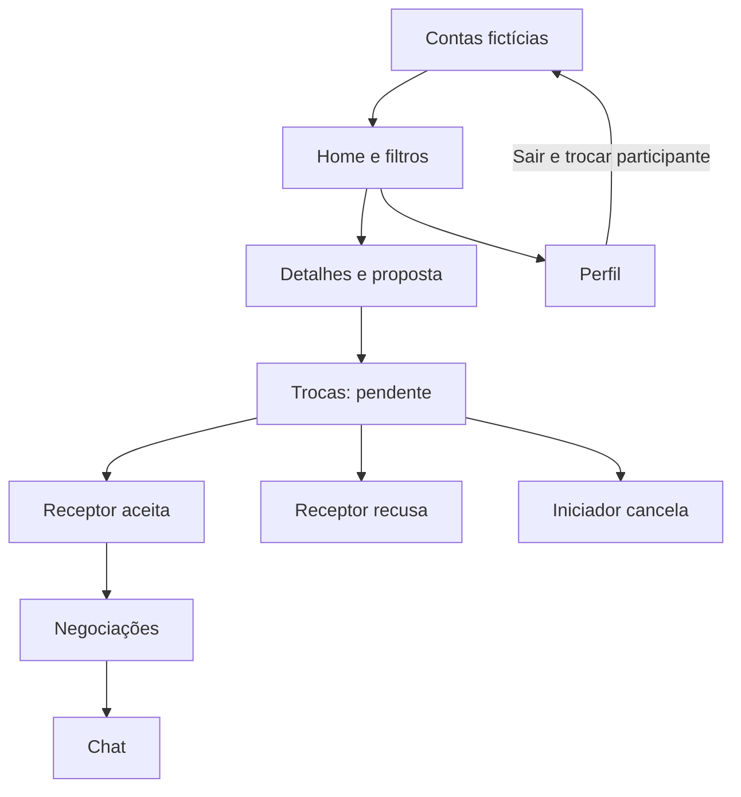

# Telas e navegação

| Tela | Entrada e ações | Destino/efeito |
| --- | --- | --- |
| Contas de demonstração | Escolher Ana, Bruno, Carla ou Cláudio | Abre Home com a perspectiva da pessoa escolhida; não solicita senha |
| Home | Buscar por nome/descrição, categoria, hoje, destaques ou histórico de trocas | Filtra itens disponíveis de outros usuários; tocar abre proposta |
| Propor troca | Ler descrição, selecionar produtos próprios, confirmar/fechar | Proposta pendente no estado compartilhado; erros ficam no modal |
| Trocas | Consultar recebidas, enviadas e histórico | Receptor aceita/recusa; iniciador cancela enquanto pendente |
| Negociações | Ver conversas aceitas e última mensagem | Abre `/chat/[id]` |
| Chat | Consultar itens e enviar texto de até 1.000 caracteres | Atualiza mensagens e prévia na lista para os dois participantes na mesma execução |
| Perfil | Ver produtos, consultar detalhe, situação do catálogo e sair | Volta para contas; trocas permanecem em memória para demonstração entre participantes |

O estado é compartilhado entre abas. Recarregar o app encerra a sessão e restaura os mocks. Rotas protegidas evitam abrir abas/chat sem uma conta selecionada; o chat também verifica participação e status aceito. Essa proteção local organiza o protótipo e não substitui autenticação de servidor.
